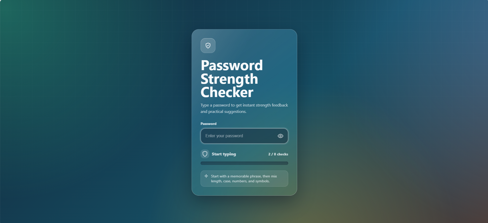
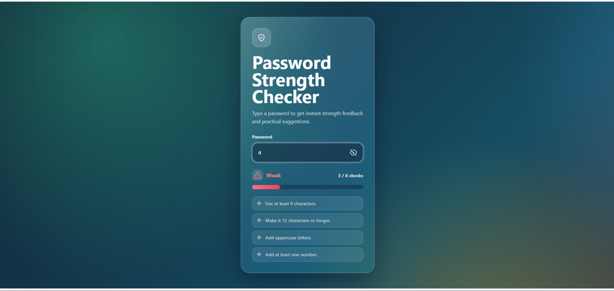
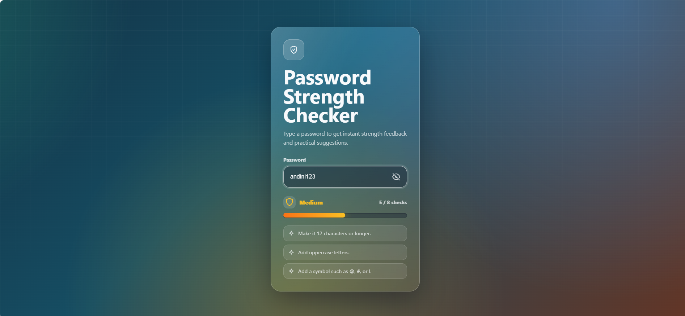
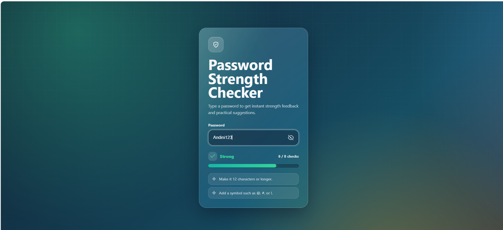

# Password Strength Checker

> Tugas Hari 1 – Short Course AI & Blockchain (AI-Assisted Build Track)

Password Strength Checker adalah aplikasi berbasis web yang digunakan untuk mengevaluasi tingkat keamanan password secara **real-time** menggunakan HTML, CSS, dan JavaScript.

Aplikasi ini menganalisis password berdasarkan beberapa aturan keamanan, kemudian menampilkan tingkat kekuatan password beserta saran untuk membantu pengguna membuat password yang lebih aman.

---

# Deskripsi

Password Strength Checker dibuat untuk membantu pengguna mengetahui tingkat keamanan password yang dibuat. Aplikasi akan mengevaluasi password secara langsung saat pengguna mengetik, kemudian memberikan indikator kekuatan password beserta saran untuk meningkatkannya.

Project ini dikembangkan sebagai tugas Hari 1 pada Short Course AI & Blockchain (AI-Assisted Build Track).

---

#  Fitur

- Tampilan modern (Glassmorphism UI)
-  Animated Gradient Background
-  Responsive Design
-  Password Strength Checker secara real-time
-  Show / Hide Password
-  Animated Progress Bar
-  Indikator kekuatan password
  - Weak
  - Medium
  - Strong
  - Very Strong
-  Saran untuk meningkatkan keamanan password

---

#  Teknologi

- HTML5
- CSS3
- JavaScript

---

#  Cara Menjalankan

1. Clone atau download repository ini.
2. Buka folder project.
3. Jalankan file `index.html` menggunakan browser.
4. Masukkan password untuk melihat hasil analisis secara real-time.

---

#  Screenshot

## Halaman Utama



---

## Password Lemah



---

## Password Medium



---

## Password Kuat



---

## Password Sangat Kuat


---

#  Cara Kerja Aplikasi

```
1. Pengguna memasukkan password
   
2. JavaScript membaca input
      
3. Password diperiksa berdasarkan aturan keamanan
 
4. Skor password dihitung
 
5. Menentukan tingkat keamanan password

6. Progress bar diperbarui
 
7. Saran ditampilkan kepada pengguna
```

---

#  Penjelasan Kode

## 1. Struktur HTML

HTML digunakan untuk membuat struktur utama halaman web, seperti:

- Input password
- Tombol Show/Hide Password
- Progress Bar
- Status kekuatan password
- Daftar saran

---

## 2. Tampilan CSS

CSS digunakan untuk mempercantik tampilan website.

Beberapa teknik yang digunakan:

- Glassmorphism
- Animated Gradient Background
- Responsive Layout
- Hover Effect
- Smooth Animation
- Progress Bar Animation

---

## 3. Logika JavaScript

JavaScript digunakan untuk membuat aplikasi menjadi interaktif.

Fungsinya meliputi:

- Membaca password yang dimasukkan pengguna.
- Memeriksa setiap aturan keamanan.
- Menghitung skor password.
- Menentukan tingkat keamanan password.
- Memperbarui progress bar.
- Menampilkan saran kepada pengguna.

### DOM Elements

JavaScript mengambil elemen HTML menggunakan `document.getElementById()` agar setiap elemen dapat dimanipulasi sesuai kebutuhan aplikasi.

### Password Rules

Password diperiksa berdasarkan beberapa aturan keamanan, antara lain:

- Minimal 8 karakter
- Minimal 12 karakter
- Mengandung huruf kecil
- Mengandung huruf besar
- Mengandung angka
- Mengandung simbol

Semakin banyak aturan yang terpenuhi, maka semakin tinggi skor keamanan password.

### Fungsi `render()`

Fungsi `render()` merupakan fungsi utama pada aplikasi.

Fungsi ini bertugas untuk:

- Membaca password yang dimasukkan pengguna.
- Memeriksa seluruh aturan keamanan.
- Menghitung skor password.
- Menentukan tingkat keamanan password.
- Memperbarui progress bar.
- Menampilkan saran kepada pengguna.

Fungsi ini akan dijalankan setiap kali pengguna mengetik atau menghapus karakter pada password sehingga hasil analisis selalu diperbarui secara real-time.

---

# Penggunaan AI

Project ini dikembangkan dengan bantuan AI (Codex) sebagai coding assistant.

AI digunakan untuk:

- Membantu membuat struktur awal HTML, CSS, dan JavaScript.
- Memberikan rekomendasi desain antarmuka.
- Membantu proses debugging.
- Menjelaskan logika kode yang dihasilkan.

Seluruh kode yang dihasilkan AI telah dipelajari, diuji, diverifikasi, dan dipahami sebelum digunakan sesuai dengan prinsip:

> **"AI sebagai asisten, programmer sebagai pengambil keputusan."**

---

# Refleksi Pembelajaran (Learning Reflection)

Selama proses pengembangan aplikasi, saya menggunakan AI sebagai coding assistant untuk membantu membangun struktur awal aplikasi.

Pada awalnya saya belum sepenuhnya memahami cara kerja beberapa bagian JavaScript, terutama fungsi `render()` yang bertanggung jawab memperbarui tampilan aplikasi secara real-time. Setelah mempelajari penjelasan AI dan mencoba menjalankan program secara langsung, saya memahami bahwa fungsi tersebut digunakan untuk membaca input password, mengevaluasi aturan keamanan, menghitung skor, memperbarui progress bar, serta menampilkan tingkat keamanan dan saran kepada pengguna.

Melalui project ini saya belajar bahwa AI dapat mempercepat proses pengembangan aplikasi, tetapi sebagai developer saya tetap harus memahami, menguji, dan memverifikasi setiap kode yang dihasilkan sebelum digunakan.

---

# Kesimpulan

Melalui project ini saya mempelajari:

- Membangun website interaktif menggunakan HTML, CSS, dan JavaScript.
- Membuat sistem validasi password secara real-time.
- Memanipulasi elemen HTML menggunakan JavaScript.
- Mendesain antarmuka yang modern dan responsif.
- Menggunakan AI sebagai coding assistant secara bertanggung jawab.
- Memahami pentingnya memverifikasi kode yang dihasilkan AI sebelum digunakan.

---

# Pembuat

**Andini Kemuning Prameswari**

Short Course AI & Blockchain (AI-Assisted Build Track)

Universitas Pamulang
