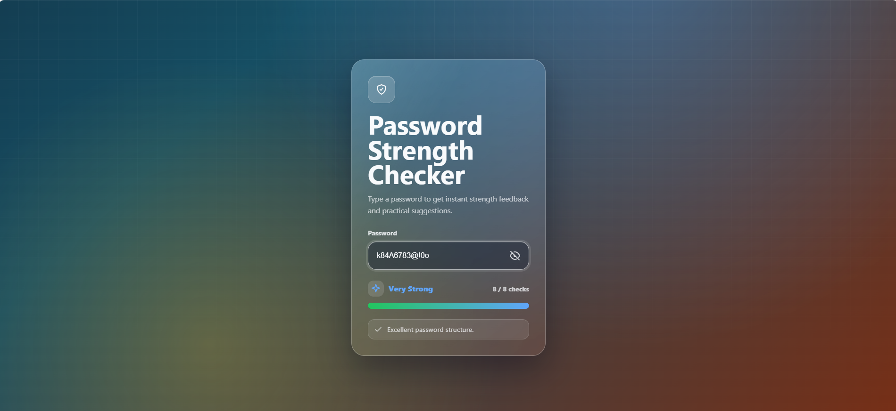

# 🔐 Password Strength Checker

> Tugas Hari 1 – Short Course AI & Blockchain (AI-Assisted Build Track)

---

# 📖 Deskripsi

Password Strength Checker adalah aplikasi berbasis web yang digunakan untuk mengecek tingkat keamanan sebuah password yang dibuat menggunakan HTML, CSS, dan JavaScript.

Aplikasi tersebut akan menganalisis password berdasarkan beberapa aturan keamanan, kemudian menampilkan tingkat kekuatan password beserta saran untuk membuat password menjadi lebih aman.

---

# ✨ Fitur

- Tampilan modern (Glassmorphism UI)
- Responsive Design
- Password Strength Checker secara real-time
- Show / Hide Password
- Progress Bar
- Indikator kekuatan password
  - Weak
  - Medium
  - Strong
  - Very Strong
- Saran untuk meningkatkan keamanan password

---

# 🛠️ Teknologi

- HTML5
- CSS3
- JavaScript

---


---

# 🚀 Cara Menjalankan

1. Download atau clone repository.
2. Buka folder project.
3. Jalankan file `index.html` menggunakan browser.


---

# 📷 Screenshot

## Halaman Utama


## Password Lemah


## Password Medium


## Password Kuat


## Password Sangat Kuat



---

# ⚙️ Cara Kerja Aplikasi

Alur kerja aplikasi sebagai berikut:

```
1. Pengguna memasukkan password

2. JavaScript membaca input
       
3. Password diperiksa berdasarkan aturan keamanan
    
4. Skor password dihitung
     
5. Menentukan tingkat keamanan password

6. Progress bar diperbarui

7. Saran ditampilkan kepada pengguna
```

---

# 💻 Penjelasan Kode

## 1. Struktur HTML

HTML digunakan untuk membuat struktur halaman, seperti:

- Input password
- Tombol Show/Hide Password
- Progress Bar
- Status kekuatan password
- Daftar saran

---

## 2. Tampilan CSS

CSS digunakan untuk mempercantik tampilan website.

Beberapa teknik yang digunakan:

- Glassmorphism
- Gradient Background
- Responsive Layout
- Animasi
- Hover Effect
- Progress Bar

---

## 3. Logika JavaScript

JavaScript digunakan untuk membuat website menjadi interaktif.

Fungsinya antara lain:

- Membaca password yang dimasukkan pengguna.
- Memeriksa setiap aturan keamanan.
- Menghitung skor password.
- Menentukan tingkat keamanan password.
- Mengubah progress bar.
- Menampilkan saran.

### DOM Elements

Mengambil elemen HTML menggunakan `document.getElementById()` agar dapat dimanipulasi menggunakan JavaScript.

### Password Rules

Password diperiksa berdasarkan beberapa aturan, seperti:

- Minimal 8 karakter
- Minimal 12 karakter
- Mengandung huruf kecil
- Mengandung huruf besar
- Mengandung angka
- Mengandung simbol

Semakin banyak aturan yang terpenuhi, maka skor password akan semakin tinggi.


### Fungsi render()

Fungsi `render()` merupakan fungsi utama pada aplikasi.

Fungsi ini akan:

- Membaca password.
- Mengecek seluruh aturan.
- Menghitung skor.
- Menentukan tingkat keamanan.
- Mengubah progress bar.
- Menampilkan saran.

Fungsi ini akan dijalankan setiap kali pengguna mengetik password.

---

# 🤖 Penggunaan AI

Project ini dibuat dengan bantuan AI (Codex) sebagai coding assistant.

AI digunakan untuk:

- Membantu membuat struktur awal HTML, CSS, dan JavaScript.
- Memberikan rekomendasi desain antarmuka.
- Membantu proses debugging.
- Menjelaskan kode yang dihasilkan.

Seluruh kode yang dihasilkan AI telah dipelajari, diuji, dan dipahami sebelum digunakan.

---

# 📝 Refleksi Pembelajaran (Log "Aku Pilot")

Selama proses pembuatan aplikasi, terdapat beberapa bagian kode JavaScript yang awalnya belum saya pahami, seperti fungsi `render()` yang menjadi fungsi utama untuk memperbarui tampilan aplikasi.

Setelah mempelajari penjelasan dari AI dan mencoba menjalankan program secara langsung, saya memahami bahwa fungsi tersebut bertugas membaca input password, mengevaluasi setiap aturan keamanan, menghitung skor, memperbarui progress bar, serta menampilkan tingkat keamanan dan saran kepada pengguna secara real-time.

Melalui project ini saya menyadari bahwa AI dapat membantu mempercepat proses pembuatan kode, tetapi sebagai developer saya tetap harus memahami, memverifikasi, dan menguji setiap kode yang dihasilkan sebelum digunakan.

---

# 📚 Kesimpulan

Melalui project ini saya belajar:

- Membuat website interaktif menggunakan HTML, CSS, dan JavaScript.
- Memahami proses validasi password.
- Menggunakan JavaScript untuk memanipulasi elemen HTML.
- Mendesain antarmuka yang modern dan responsif.
- Menggunakan AI sebagai coding assistant secara bertanggung jawab.

---

# 👩‍💻 Pembuat

**Andini Kemuning Prameswari**

Short Course AI & Blockchain (AI-Assisted Build Track)

Universitas Pamulang